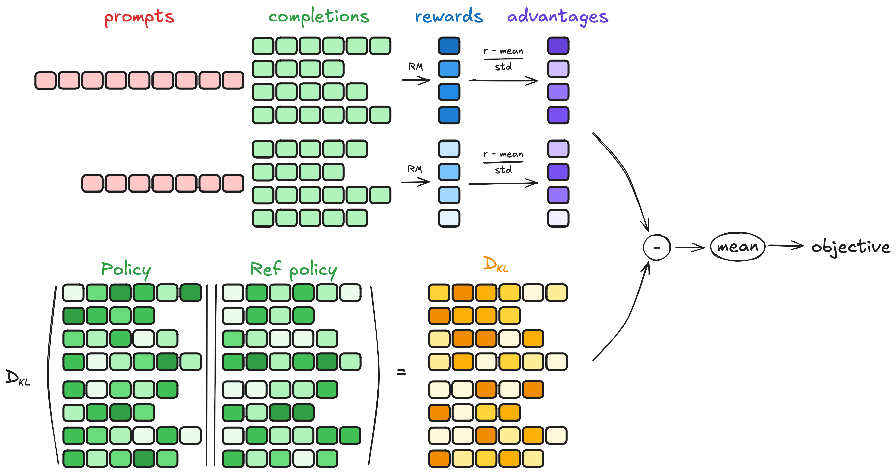
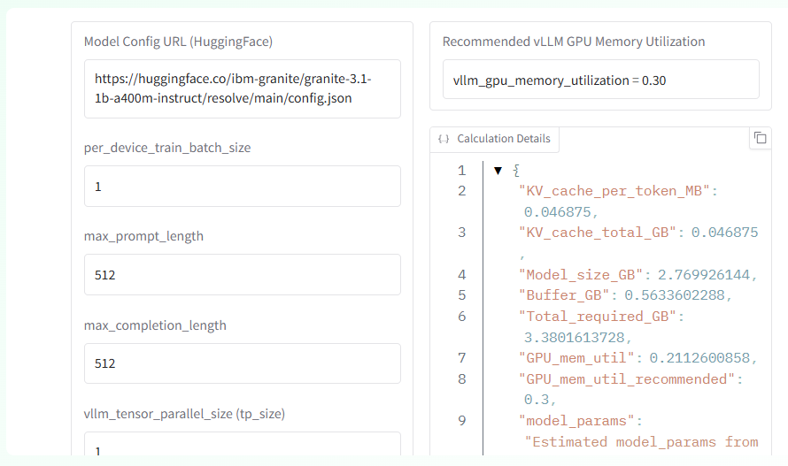
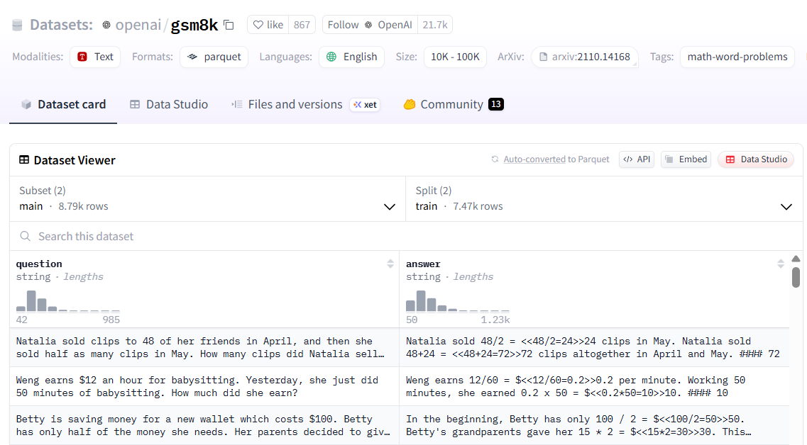
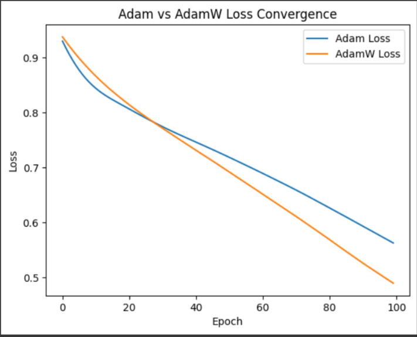
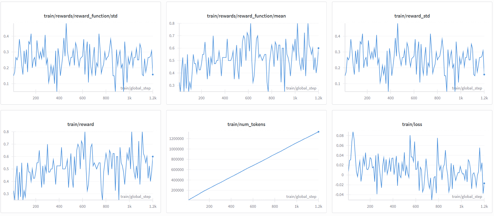
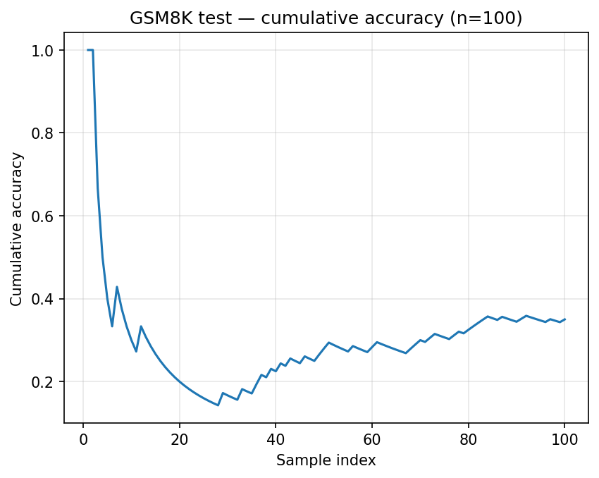
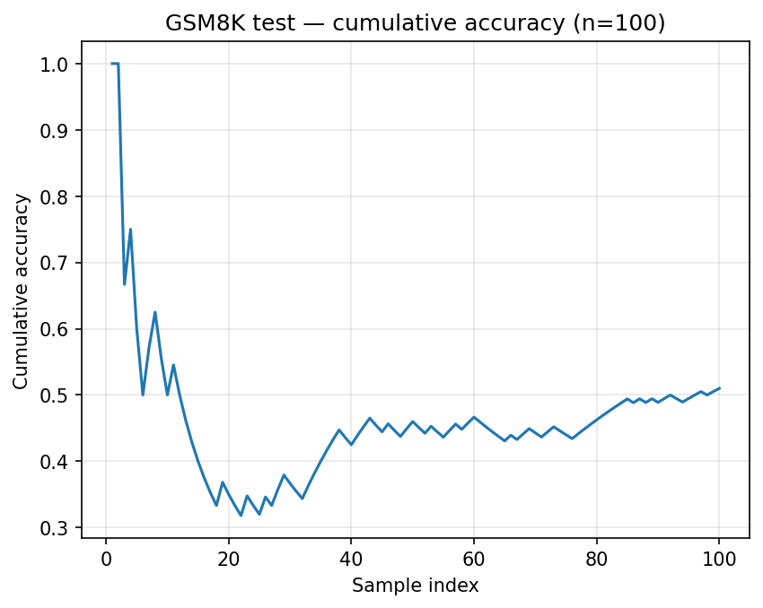

# Finetuning IBM Granite MoE 1.3B with Reinforcement Learning GRPO on GSM8K dataset

#### This project demonstrates how to fine-tune the IBM Granite MoE 1.3B model using the GRPO (Generalized Reward Policy Optimization) algorithm on the GSM8K dataset. The training process leverages the capabilities of the `transformers` and `trl` libraries from Hugging Face, along with other essential libraries for efficient training and evaluation

## Model Architecture
```
GraniteMoeForCausalLM(
  (model): GraniteMoeModel(
    (embed_tokens): Embedding(49155, 1024, padding_idx=0)
    (layers): ModuleList(
      (0-23): 24 x GraniteMoeDecoderLayer(
        (self_attn): GraniteMoeAttention(
          (q_proj): Linear(in_features=1024, out_features=1024, bias=False)
          (k_proj): Linear(in_features=1024, out_features=512, bias=False)
          (v_proj): Linear(in_features=1024, out_features=512, bias=False)
          (o_proj): Linear(in_features=1024, out_features=1024, bias=False)
        )
        (block_sparse_moe): GraniteMoeMoE(
          (activation): SiLU()
          (input_linear): GraniteMoeParallelExperts()
          (output_linear): GraniteMoeParallelExperts()
          (router): GraniteMoeTopKGating(
            (layer): Linear(in_features=1024, out_features=32, bias=False)
          )
        )
        (input_layernorm): GraniteMoeRMSNorm((1024,), eps=1e-06)
        (post_attention_layernorm): GraniteMoeRMSNorm((1024,), eps=1e-06)
      )
    )
    (norm): GraniteMoeRMSNorm((1024,), eps=1e-06)
    (rotary_emb): GraniteMoeRotaryEmbedding()
  )
  (lm_head): Linear(in_features=1024, out_features=49155, bias=False)
)
```
## Looking deeper into the GRPO Trainer

The GRPO Trainer is a specialized training loop designed for fine-tuning large language models using the GRPO (Generalized Reward Policy Optimization) algorithm. To understand how GRPO works, it can be broken down into four main steps: 
- **Generating completions**
- **Computing the advantage**
- **Estimating the KL divergence**
- **Computing the loss**



## vLLM GRPO GPU Memory Utilization Estimator

The vLLM library is a high-performance inference engine for large language models (LLMs) that optimizes GPU memory usage and computational efficiency. It is designed to handle the challenges of serving large models, such as memory fragmentation and inefficient batching.

To optimize GPU memory usage during training, the vLLM library provides a GPU memory utilization estimator. This tool helps in determining the appropriate memory utilization settings for efficient training of large language models.



To ensure 16GB GPU memory compatibility, the recommended vllm_gpu_memory_utilization parameter will be set:

- **vllm_gpu_memory_utilization = 0.3**

### Dataset GMS8K

The dataset used for training is the [GSM8K](https://huggingface.co/datasets/openai/gsm8k) dataset, which contains 8.79k high-quality linguistically diverse grade school math word problems. The dataset is split into training and validation sets, with 7.47k problems for training and 1.32k problems for validation.

The answers are provided in a step-by-step format, and the exact answer is always the last number in the solution. We will use a regex pattern **to extract the final answer** from the solution.



## Rewarding function
The rewarding function is based on the correctness of the final answer. If the final answer matches the expected answer, a reward of +1 is given; otherwise, a reward of 0 is assigned. This binary reward system encourages the model to generate correct answers.

## AdamW Optimizer
The AdamW optimizer is used for training, which is a variant of the Adam optimizer that decouples weight decay from the gradient update. This helps in better regularization and often leads to improved performance and generalization of the model.



## Automatic Mixed Precision (AMP)
Automatic Mixed Precision (AMP) is enabled to optimize memory usage and computational efficiency during training. By using lower precision (like float16 or bfloat16) for certain operations, AMP can significantly reduce the memory footprint and speed up training without sacrificing model accuracy.


## Installation

- Developed the project with Python 3.13:

[Download Python 3.13](https://www.python.org/downloads/release/python-413/)

- If you want to use CUDA for training, download [CUDA Toolkit](https://developer.nvidia.com/cuda-downloads) for your computer

- Clone the repository :

```
git clone https://github.com/VictorRios-hub/MoE_finetuning.git
```
```
cd MoE_finetuning
```

- Requirements to run the scripts can be found in the requirements.txt file, it is recommended to use a virtual environment: 

```python -m venv venv```

```source venv/bin/activate```

```pip install -r requirements.txt``` 

- Install torch and CUDA for your device

Check your ***CUDA*** version using ```nvcc --version``` and go [here](https://pytorch.org/get-started/locally/) to check your appropriate torch version

Then, install the correct version using : ```pip install torch --index-url YOUR_VERSION``` 

If you followed the previous steps, your installation should be the same as mine : ```pip3 install torch torchvision --index-url https://download.pytorch.org/whl/cu126```

### Configurations

- If you want to use [Weights & Biases](https://wandb.ai/site) to track your experiments, create an account and set up your API key using the command ```wandb login```
- If you want to use accelerate to launch your training, run the command ```accelerate config``` to set up your training configuration

## Getting started

### Test the baseline
You can test the baseline model by running the [chat.py](chat.py) script with the command ```python chat.py```

You'll see the model generating a **wrong** answer to the question you just asked 😅

### Train the model
Since you have everything installed, you can start the training session by running [train.py](train.py) with the command ```python train.py```

**However**, I recommend running the following command ```accelerate launch train.py```
This command runs your train.py script using the Accelerate library, which helps manage distributed training and hardware acceleration.

### Evaluate the model
You can then run the evaluation process using the command ```python eval.py --adapter_dir checkpoints --n 200 --batch_size 2```

Feel free to visualize the results on the chart !

### Test the finetuned model

You can test the finetuned model on several questions, by running the [test_inference.py](test_inference.py) script with the command ```python test_inference.py```

## Results
After training the model for **1200 steps**, we can observe a significant improvement in its performance on the GSM8K dataset. The model's ability to solve math word problems has increased, as evidenced by the reward function and evaluation metrics:

### Visualizations
- **Training Reward Function**: The training reward function shows a steady increase over the training steps, indicating that the model is learning to generate correct answers more frequently.


**Note**: My training was launched with vLLM set to false, due to the Windows OS compatibility issues on my computer. With that configuration, the training time was around 6 hours for 1200 steps on a single NVIDIA RTX A3000 Laptop GPU with 6GB of VRAM.

#### For your training, I configured 1000 steps, which should be enough to see a significant improvement in the model's performance with vLLM set to true with under 4 hours of training time.

- **Evaluation Accuracy**: The evaluation accuracy also shows an upward trend, demonstrating that the model's performance on unseen data is improving as it learns from the training data.

#### Baseline vs Finetuned Model Accuracy
- Baseline Mean Model Accuracy: 0.37


- Finetuned Model Mean Accuracy after 1000 steps: 0.51


### Model Comparison
| Model                        | Steps  | Reward Function (Accuracy) | Evaluation Accuracy |
|------------------------------|--------|----------------------------|---------------------|
| Granite MoE 1.3B (Baseline)  | 0      | ~0.3                       | 0.35                |
| Granite MoE 1.3B (Finetuned) | 1000    | ~0.65                      | 0.51                |

## Documentation:

### My references : 
- [Transformers](https://huggingface.co/docs/transformers/index)
- [Tokenizer](https://huggingface.co/docs/transformers/main_classes/tokenizer)
- [Auto Classes](https://huggingface.co/docs/transformers/main/en/model_doc/auto)
- [Efficient Fine-Tuning with LoRA](https://www.databricks.com/blog/efficient-fine-tuning-lora-guide-llms)
- [GRPO Trainer](https://huggingface.co/docs/trl/main/en/grpo_trainer)

### Citations :

```bibtex
@article{shao2024deepseekmath,
    title        = {{DeepSeekMath: Pushing the Limits of Mathematical Reasoning in Open Language Models}},
    author       = {Zhihong Shao and Peiyi Wang and Qihao Zhu and Runxin Xu and Junxiao Song and Mingchuan Zhang and Y. K. Li and Y. Wu and Daya Guo},
    year         = 2024,
    eprint       = {arXiv:2402.03300},
}

```

```bibtex
@misc{vonwerra2022trl,
	title        = {{TRL: Transformer Reinforcement Learning}},
	author       = {Leandro von Werra and Younes Belkada and Lewis Tunstall and Edward Beeching and Tristan Thrush and Nathan Lambert and Shengyi Huang and Kashif Rasul and Quentin Gallou{\'e}dec},
	year         = 2020,
	journal      = {GitHub repository},
	publisher    = {GitHub},
	howpublished = {\url{https://github.com/huggingface/trl}}
}
```

```bibtex
@article{cobbe2021gsm8k,
  title={Training Verifiers to Solve Math Word Problems},
  author={Cobbe, Karl and Kosaraju, Vineet and Bavarian, Mohammad and Chen, Mark and Jun, Heewoo and Kaiser, Lukasz and Plappert, Matthias and Tworek, Jerry and Hilton, Jacob and Nakano, Reiichiro and Hesse, Christopher and Schulman, John},
  journal={arXiv preprint arXiv:2110.14168},
  year={2021}
}
```

### License :

All Granite 3.0 Language Models are distributed under [Apache 2.0](https://github.com/ibm-granite/granite-3.1-language-models/blob/main/LICENSE) license.
